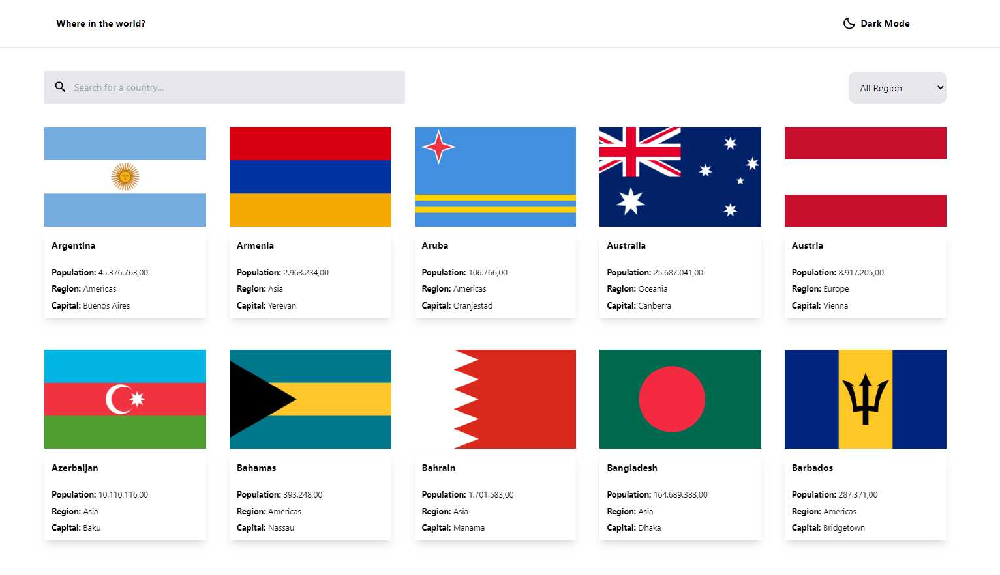

---

# Frontend Mentor Challenge

If you're looking to test your JavaScript skills, this is the challenge for you. Utilize your preferred JavaScript framework and fetch data from the REST Countries API.

## Introduction

Your challenge is to integrate with the REST Countries API to fetch country data and display it as shown in the provided designs.

You have the freedom to use any JavaScript framework or library for the frontend, such as React or Vue. Additionally, you can choose which packages to use for making HTTP requests or styling your project.

Your users should be able to:

- View a list of all countries from the API on the homepage.
- Search for a specific country using an input field.
- Filter countries by region.
- Click on a country to access more detailed information on a separate page.
- Navigate to neighboring border countries from the detail page.
- Experience responsive design for different screen sizes.
- Observe hover and focus states for all interactive elements on the page.

**Bonus:** Implement a feature that allows users to toggle between light and dark color schemes.

## Screenshots

---